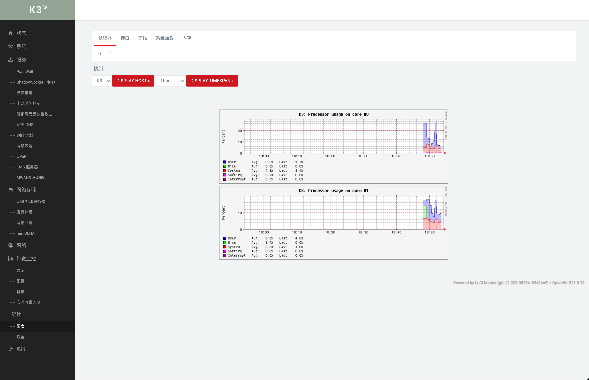
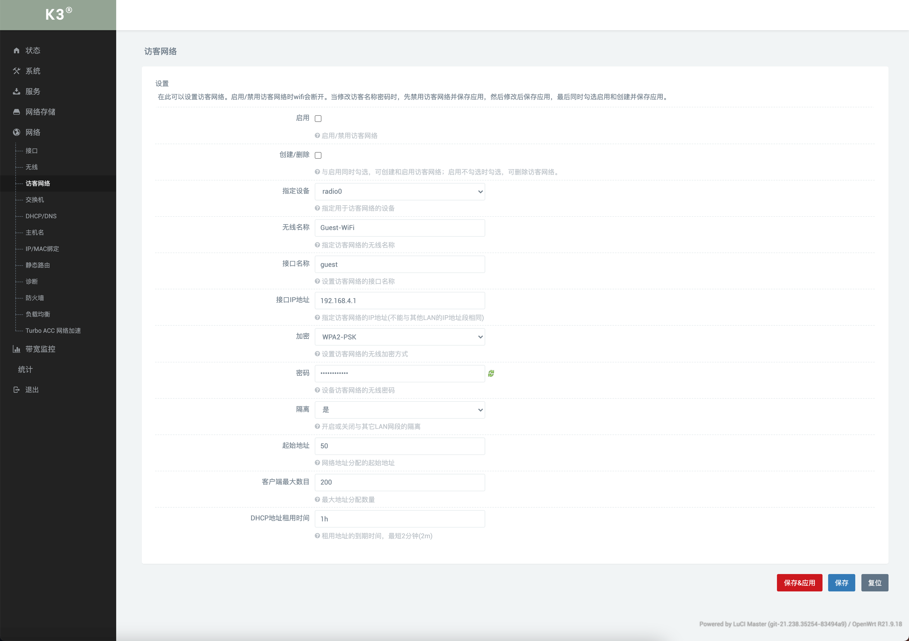

# k3_packages_backup

## 一些样图

 

> k3的固件和插件备份仓库，自己编译自己使用，仅此备份，按需自取。  
> 有时间会解答你们的安装或者编译问题，没时间也请见谅，谢谢。  
> 编译环境为 Ubuntu 18.04 Desktop x64，大雕的说明没有说是桌面版本还是服版本，再次提醒下想自己编译的朋友。  
> 源码来自[lede](https://github.com/coolsnowwolf/lede)，更多问题解答请前往他的`issue`里面搜索下，不要什么不懂，张嘴就问！要培养自己的`problems solving skill`。  
> 如果需要加入一些特殊功能，请在克隆后把`lede`目录下的`feeds.conf.default`文件的`#src-git helloworld https://github.com/fw876/helloworld` `#`去掉然后在按照步骤开始编译

### 最新编译时间:2021/09/30  

系统更新到: `OpenWrt R21.9.18 / LuCI Master (git-21.238.35254-83494a9)`   
内核: `5.4.145`  
新增服务: 
- `微信推送 —— ServerChan `
- `WiFi 计划`
- `MWAN3 分流助手`
- `USB 打印服务器`
- `硬盘休眠`
- `miniDLNA`
- `实时流量监测`
- `统计图标`  

更新服务:
- `xray` 更新到 `v1.4.5`
- `ShadowSocksR Plus+` 更新到最新
> 其中 `xray` 和 `ShadowSocksR Plus+` 可以在仓库的目录单独下载，在路由器的后台-系统-文件传输-上传，
然后安装更新（更新前记得先停用）
